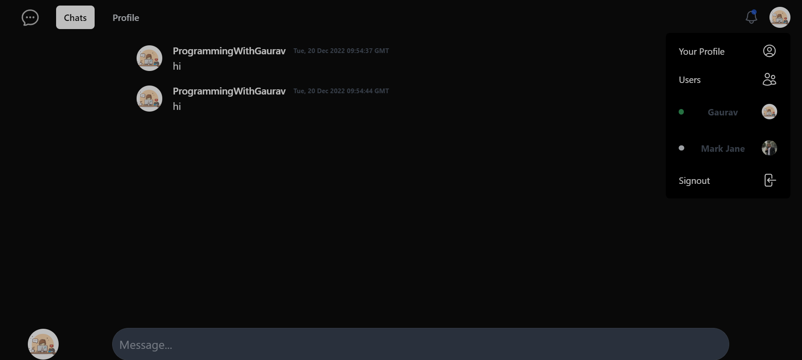

# Realtime Chat App With Supabase

# Screenshot


# Tech Stacks And Features 🌟
- Realtime message (used supabase)
- signin (with github) and signout feature
- profile page

# If you want to improve this feel free to contribute

This is a [Next.js](https://nextjs.org/) project bootstrapped with [`create-next-app`](https://github.com/vercel/next.js/tree/canary/packages/create-next-app).

## Getting Started

First, run the development server:

```bash
npm run dev
# or
yarn dev
```
